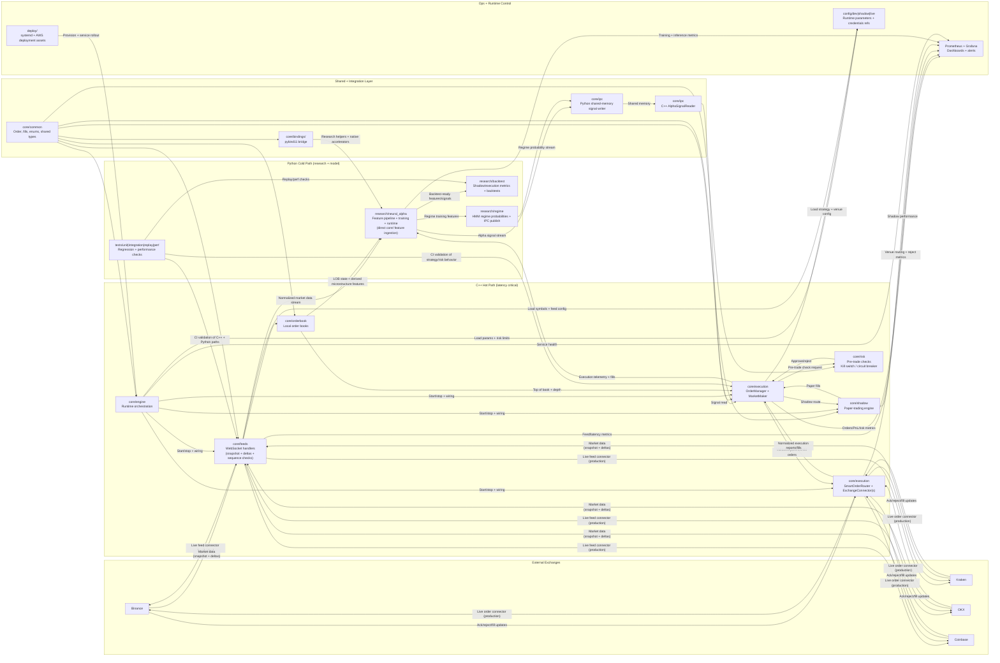

# TradingInfrastructureCrypto Architecture Overview

This is a high-level map of how each system block talks to the others.

## Component Interaction Diagram



## How each block is used

## Recent updates

- ✅ **Four fully working venues for feeds and orders**: Binance, Kraken, OKX, and Coinbase are now represented as live production connectors on both the market data path (`core/feeds`) and execution path (`core/execution` smart order router).
- ✅ **Neural network now consumes data directly from `core/`**: `research/neural_alpha` receives normalized market data, order book state, and execution telemetry directly from core components for model training/inference inputs.

- **`core/feeds`**: Maintains real-time exchange market data streams and validates message order before updating internal state.
- **`core/orderbook`**: Stores the in-memory book per symbol; execution logic reads this for spread, depth, and microstructure signals.
- **`core/risk`**: Gatekeeper in front of trading actions; enforces limits and can halt trading fast.
- **`core/execution`**: Decides quotes/orders, tracks positions, and hands validated orders to the smart order router for venue submission.
- **`core/ipc`**: Shared-memory bridge between Python model output and C++ strategy input.
- **`core/execution` smart order router**: Splits/routes validated orders to Binance/Kraken/OKX/Coinbase connectors and normalizes venue acks/fills back to execution.
- **`core/shadow`**: Runs the same trading logic in paper mode to validate behavior before live deployment.
- **`research/neural_alpha`**: Trains and generates alpha signals from features ingested directly from `core/feeds`, `core/orderbook`, and execution telemetry.
- **`research/regime`**: Learns regime probabilities (`calm`, `trending`, `shock`, `illiquid`) and publishes them over IPC for live consumption.
- **`research/backtest`**: Produces shadow/execution metrics and replays market events to evaluate strategy quality offline.

## Typical lifecycle (short)

1. **Research** trains/tests a model in Python (`research/*`).
2. Model writes alpha signals to **IPC shared memory**.
3. C++ **execution** reads signal + order book state + risk checks.
4. Orders go either to **shadow** (paper) or **live exchanges**.
5. Metrics flow to monitoring for operational health and performance.

## Build/Bootstrap preflight

Run the dependency checker before local builds or production bootstrap:

```bash
python3 deploy/scripts/preflight_check.py
```

It validates required tooling and native dependencies (`cmake`, `pkg-config`, `libwebsockets`, `libcurl`, `nlohmann/json`) and exits non-zero on missing prerequisites.
